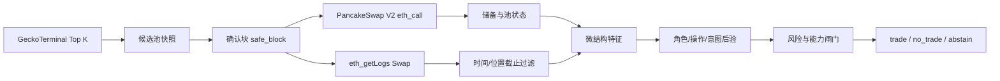

# BSC WebUI 前端说明书：分析区、推理区与算法

版本：`bsc-webui.v0.1`  
适用范围：`Market Intent Inference` 的 BSC paper-only MVP。  
最后更新：2026-07-28

本文解释前端「分析区」和「推理区」每个字段的意义、数据来源、计算方法、决策规则以及当前版本的能力边界。当前系统只读链上数据，不连接钱包、不发送交易，也不构成投资建议。

## 1. 先理解两个区域的区别

前端把结果拆成两层：

- **分析区**：回答“市场刚刚发生了什么”。这里主要是 RPC 核验、池子储备、Swap 事件和派生微结构特征。
- **推理区**：回答“这些观察可能意味着什么，以及现在是否允许采取动作”。这里对应角色（role）、可观察操作（action）、潜在意图（intent）、风险闸门和最终 paper 决策。

当前 MVP 的重要限制是：链上观察和特征已经接入，但 BSC 实时管线还没有接入带标签的训练样本。因此推理区会明确输出 `abstain=true`、`uncalibrated` 或 `abstain_no_labels`，不会把未经训练的猜测包装成概率。

## 2. 一次分析的完整链路



具体顺序如下：

1. GeckoTerminal 按 `h24_volume_usd` 发现 BSC 候选池，默认 Top 3。Provider 的交易量、流动性和交易数只用于排序和展示。
2. 计算确认块：`safe_block = latest_block - confirmation_lag`。默认 `confirmation_lag=3`，避免把尚未稳定的最新块当成事实。
3. 使用 PancakeSwap V2 的只读 `eth_call` 核验池子、`token0`、`token1`、`getReserves`、factory 和 router。
4. 在 `[safe_block - lookback_blocks, safe_block]` 范围内读取 Swap 日志。默认 `lookback_blocks=40`。
5. 只有事件时间不晚于 safe block 时间、且事件位置不超过截止点的日志才进入严格特征；缺少时间戳的日志可以在 `recent_swaps` 中展示，但不能进入模型特征。
6. 根据储备和 Swap 计算特征，构造 `PredictionContext`，再执行角色/操作/意图后验和 fail-closed 决策。

## 3. 分析区字段说明

### 3.1 池子身份与链上核验

| 前端字段 | 意义 | 解读方式 |
|---|---|---|
| 池子标题、Pool CA | 被分析的 AMM 池和合约地址 | Pool CA 是链上定位键；不要只依赖代币名称。 |
| `rpc_verified` | 池子是否通过 RPC 核验 | `true` 表示链上 token、储备、factory/router 读取成功；不表示代币安全。 |
| `base / quote` | Provider 或链上补全的展示方向 | 可能为空或方向不稳定，做精确分析时以 `token0 / token1` 和事件 amount 方向为准。 |
| `token0 / token1` | PancakeSwap Pair 合约中的固定 token 顺序 | 所有 `amount0_*`、`amount1_*` 都相对于这一顺序，不能随意当成 base/quote。 |
| `factory`、`router` | 核验到的 PancakeSwap V2 工厂和路由合约 | 用于确认池子属于预期 DEX；是来源核验，不是交易信号。 |

### 3.2 储备、价格与冲击代理

| 前端字段 | 当前计算 | 意义与限制 |
|---|---|---|
| `reserve0 / reserve1` | Pair 的 `getReserves()` 原始整数转成浮点数 | 表示 token0/token1 储备。当前版本未在展示层统一应用 token decimals，因此大数主要用于相对比较和审计。 |
| `mid_price` | `reserve1 / reserve0`，当 `reserve0 > 0` 时 | 表示按当前实现方向计算的 token1 per token0 价格代理；不是经过 decimals 修正的报价，也不是订单簿中间价。 |
| `price_impact_proxy` | `abs(token0_flow) / reserve0` | 是“净 token0 流量相对于 token0 储备”的粗略冲击代理，不是精确 AMM 曲线成交冲击。精确冲击应使用交易前后储备、输入规模、手续费和 decimals 重算。 |
| `token0_flow`、`token1_flow` | 输入量减输出量 | 主要写入 `summary.json` 供审计和后续研究，当前分析卡片未单独展示。方向必须结合 token0/token1 判断。 |

### 3.3 Swap 流和事件密度

| 前端字段 | 当前计算 | 意义与限制 |
|---|---|---|
| `buy / sell` | 若 `amount0_in > 0` 且 `amount1_out > 0`，计为 buy；若 `amount1_in > 0` 且 `amount0_out > 0`，计为 sell | 这是当前 token0/token1 方向下的事件分类，不是基于钱包角色的“买入/卖出”。 |
| `ofi_net_flow` | `buy_count - sell_count` | 当前是**事件数量 OFI**，不是成交金额加权 OFI。正值表示 buy 事件更多，负值表示 sell 事件更多，绝对值不能直接当成收益强度。 |
| `swap_count` | 进入时间截止过滤后的 Swap 数 | 代表本次严格可用的事件数量；日志读取失败时可能为 0。 |
| `event_density` | `len(timed_logs) / max(lookback_blocks, 1)` | 每个回看区块的事件密度，不能直接与不同 lookback 参数的结果横向比较。 |
| `failure_count` | 日志读取发生降级时为 `1.0`，否则为 `0.0` | 用于提示数据源质量，而不是链上失败交易数量。 |

### 3.4 `recent_swaps` 表

| 字段 | 意义 |
|---|---|
| `block` | Swap 所在区块号。 |
| `tx/log` | 交易索引 / 日志索引；与 block 一起构成事件位置排序。 |
| `a0_in`、`a1_in` | token0/token1 输入数量。 |
| `a0_out`、`a1_out` | token0/token1 输出数量。 |
| `event_time` | 由区块时间解析出的 UTC 时间；缺失时事件仅保留展示用途。 |

事件位置按 `(block_number, transaction_index, log_index)` 字典序排序。`data_cutoff` 是本次可证明读取到的最后事件位置，不等于“预测未来”，而是防止同一分析中混入截止点之后的数据。

### 3.5 `reason` 与 `error_detail`

常见原因码：

- `abstain_no_labels`：有可用链上特征，但当前没有训练标签，不能生成可靠后验。
- `insufficient_data`：没有足够的时间有效事件，或 safe block 时间缺失。
- `source_unavailable`：RPC、Provider 或 `eth_getLogs` 不可用。
- `quality_failed`：数据完整性或质量校验失败。

`error_detail` 是本次读取失败的可审计说明。它描述数据源问题，不应被当成交易观点；出现 archive 限制或超时后，系统会保留已有储备特征，并对推理采取 abstain/no-trade。

## 4. 推理区字段说明

### 4.1 `decision`

最终 paper 决策状态只有三类：

| 状态 | 含义 |
|---|---|
| `trade` | 所有数据、风险、能力和校准条件都通过，并且请求动作被场所能力支持。当前 BSC MVP 不会产生真实写链。 |
| `no_trade` | 观察数据存在，但风险、场所能力或策略约束阻止采取动作。它不是“看跌”，也不是“建议做空”。 |
| `abstain` | 当前证据不足，系统无法形成可负责的判断，例如数据源不可用、未来数据或后验未校准。 |

当前 BSC MVP 的风险字段默认是 `not_supported`，因此即使第一个池有真实 Swap，通常也会得到 `no_trade / risk_unknown`；如果连日志都无法获得，则会得到 `abstain / insufficient_data` 或 `source_unavailable`。

### 4.2 `paper`

`paper=true` 表示只做观察、推理和回测准备，不执行订单。代码层强制拒绝 `paper=false`，并且 venue capability 禁止写链。

### 4.3 `decision reasons`

决策原因来自固定的 fail-closed 优先级：

1. `paper_only`：请求了非 paper 模式。
2. `future_data`：输入包含预测时点之后的数据。
3. `insufficient_data`：严格可用数据不足。
4. `risk_blocked`：风险字段明确发现阻断条件。
5. `risk_unknown`：风险字段为 `unknown` 或 `not_supported`，系统选择不交易。
6. `unsupported_venue`：场所不支持请求的操作或模式。
7. `uncalibrated`：后验未校准，不能进入交易决策。

优先级的设计目标是宁可少交易，也不把未知风险误判为安全。

### 4.4 `prediction abstain` 与 `prediction reasons`

`prediction abstain=true` 表示角色、操作或意图后验至少有一个不能可靠生成。常见原因是：

- `abstain_no_labels`：有特征，没有训练标签；
- `insufficient_data`：没有足够的有效事件；
- `source_unavailable`：数据源读取失败。

当前前端可能同时显示 `roles`、`actions`、`intents` 三组枚举。它们是**候选状态空间**，不是当前样本的概率分布。当前版本没有在 BSC live pipeline 中输出数值 posterior，所以不能把枚举列表解读成“每个类别概率相同”。

### 4.5 `calibration`

- `calibrated`：概率经过独立验证，能用于阈值和期望效用决策。
- `uncalibrated`：尚未完成校准；当前 BSC MVP 的默认状态。
- `not_applicable`：该结果不适合做概率校准。

没有校准的高概率不能直接当作 alpha。校准应使用时间切分、严格 cutoff 和独立验证集完成。

### 4.6 `model / feature / label`

当前默认值：

| 字段 | 当前值 | 意义 |
|---|---|---|
| model | `none.v0` | 尚未接入训练模型。 |
| feature | `bsc_microstructure.v0` | 当前储备、Swap、OFI、密度和截止点特征契约版本。 |
| label | `none.v0` | 尚未接入角色/操作/意图标签集。 |

版本号用于防止回测时把不同字段定义混在一起。

### 4.7 时间字段与预测目标

| 字段 | 意义 |
|---|---|
| `decision_time` | safe block 的区块时间，代表系统允许使用信息的时间点。 |
| `horizon_end` | 当前版本为 `decision_time + 5 分钟`，是未来评估窗口的结束时间。 |
| `target` | 当前固定为 `next_observed_action`，即未来窗口内下一个可观察操作；它不是当前已经发生的操作。 |
| `data_cutoff` | 当前特征可使用的最后事件位置。训练/预测时必须满足 `training_cutoff <= data_cutoff <= decision_position`。 |

### 4.8 `feature snapshot`

这是把最重要的三项特征压缩成一行，便于快速检查：

- `swaps`：有效 Swap 数；
- `ofi`：当前事件数量 OFI；
- `mid`：当前实现的储备价格代理。

它不是完整 feature vector，完整值应以 `summary.json` 为准。

### 4.9 `risk`

风险模型预留了以下字段：

- `token_transfer_restriction`：转账限制；
- `sellability`：是否可卖出；
- `transfer_tax`：转账税/买卖税；
- `owner_control`：管理员控制风险；
- `mint_authority`：增发权限；
- `pause_authority`：暂停权限；
- `lp_withdrawal`：流动性撤出风险；
- `holder_concentration`：持仓集中度；
- `honeypot_screen`：蜜罐筛查。

每个风险项可以是 `known_true`、`known_false`、`unknown` 或 `not_supported`。前端当前把它们压缩显示为 `unknown / not_supported → no-trade`，完整逐项状态在 Run 审计的 `summary.json` 中。

## 5. 当前后验算法与未来扩展

### 5.1 已实现的通用条件后验

领域推理模块提供条件频率后验：

\[
P(I=i \mid R=r, A=a, D) =
\frac{N(i,r,a;D)+\alpha}{N(r,a;D)+K\alpha}
\]

其中：

- `I` 是潜在意图；
- `R` 是角色；
- `A` 是已观察操作；
- `D` 是不晚于 training cutoff 的训练数据；
- `K` 是固定意图类别数；
- 第一切片固定 `alpha=1.0`，即 Laplace/add-one smoothing。

训练记录必须满足：

- 事件位置 `<= training_cutoff`；
- `training_cutoff <= data_cutoff <= decision_position`；
- 质量不是 `unknown`；
- role/action 必须来自固定枚举。

如果没有匹配记录，返回空 posterior 并 `abstain=true`，而不是返回一组伪造的均匀概率。

### 5.2 BSC live MVP 当前实际采用的算法

BSC live pipeline 当前还没有训练记录输入，因此对 role、action、intent 都构造 abstain posterior：

```text
链上观察 → 特征计算 → posterior 空结果 / abstain_no_labels
                      ↓
             风险 not_supported
                      ↓
                 no_trade
```

因此当前系统的“算法价值”主要在于：

1. 把 provider 快照和链上事实分开；
2. 用 safe block 和 data cutoff 防止未来数据泄漏；
3. 把 Swap 方向、储备、事件密度等事实转换为可复现特征；
4. 在数据不足、风险未知或概率未校准时 fail-closed。

真正的角色/意图概率模型需要下一阶段接入标签、钱包/地址聚类、时间切分训练集、概率校准和独立回测。

## 6. 如何阅读一次真实结果

例如某池显示：

```text
swap_count=2
buy/sell=0/2
ofi_net_flow=-2
event_density=0.05
prediction=abstain_no_labels
decision=no_trade
decision_reason=risk_unknown
```

正确解释是：在当前 40 个回看区块中，系统观测到 2 个符合时间截止条件的 Swap，按当前 token0/token1 方向分类为 2 个 sell 事件；但这不能证明“某个角色在做止损”，也不能证明未来下跌。由于没有训练标签和风险支持，系统拒绝把它转成交易动作。

如果某池显示 `source_unavailable`，应先处理 RPC/Provider 数据质量，再讨论 alpha；不能用零 Swap 当作“市场没有交易”。

## 7. 运行参数对结果的影响

| 参数 | 作用 | 影响 |
|---|---|---|
| `Top K` | 选择分析池数量，范围 1–10 | 增大后覆盖更多池，但 RPC 请求和失败概率上升。 |
| `Lookback blocks` | Swap 事件回看区块数，范围 1–5000 | 增大后事件更多，但免费 RPC 更容易超时或触发归档限制。 |
| `Confirmation lag` | 从最新块回退的确认区块数，范围 0–64 | 增大后数据更稳定，但更滞后。 |

改变参数后，不能直接比较未经归一化的 `event_density`、`swap_count` 或 OFI；回测必须把参数写入 run 配置并按同一版本比较。

## 8. 当前已知边界

- GeckoTerminal 的 volume/liquidity/transactions 是发现排序信息，不等于链上核验事实。
- 免费 RPC 对历史 `eth_getLogs` 的保留范围和超时限制不稳定；系统会标记降级并 abstain。
- 当前 OFI 按事件数量计算，尚未做金额、美元价值或价格冲击加权。
- 当前 `mid_price` 尚未统一处理 token decimals。
- 当前风险项多数为 `not_supported`，所以系统默认不会给出交易许可。
- 当前没有真实角色标签、意图标签或校准模型，因此 UI 中的角色/操作/意图列表只是状态空间定义。
- `no_trade` 不等于做空；它表示系统没有批准任何交易动作。

## 9. 推荐的下一步

1. 先把 Swap 方向、地址、时间、金额和池状态标准化为可审计事实。
2. 对地址和行为做聚类，形成弱角色标签，并保留标签置信度。
3. 用时间切分构造 `role × observed_action × intent` 训练记录。
4. 接入 Laplace 后验、校准曲线、Brier score 和 out-of-time 回测。
5. 完成 token decimals、可卖性、税、管理员权限和 holder concentration 风险字段后，再开放策略层实验。

